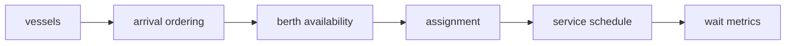

# Architecture

## Vessel model
Each vessel has an arrival time and service duration.

## Berth state
Each berth tracks its next available time.

## Scheduler
Vessels are assigned to the earliest available berth.

## Metrics
Assignments expose start, finish, and waiting time.

## Principle
Expose a simple scheduling baseline first so later optimization gains have something honest to beat.
